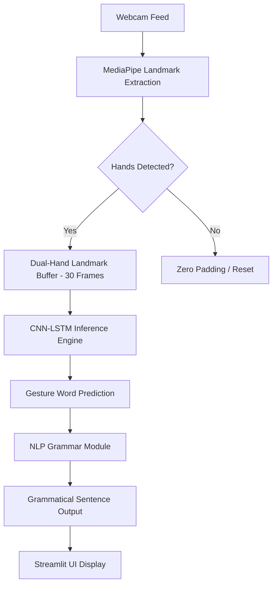

# 🤟 GestureLink: Real-Time Dual-Hand Sign Language Translator

**GestureLink** is a state-of-the-art Sign Language to Text conversion system that bridges the communication gap using deep learning. It leverages **MediaPipe** for high-fidelity hand tracking, a custom **CNN-LSTM** architecture for temporal gesture recognition, and a specialized **NLP Grammar Engine** to generate coherent natural language sentences from sequence predictions.


---

## 🚀 Key Features

- **👐 Dual-Hand Recognition**: Tracks both hands simultaneously (42 landmarks, 126 features) for complex gesture support.
- **🧠 Hybrid CNN-LSTM Model**: Combines spatial feature extraction (1D-CNN) with temporal sequence modeling (Stacked LSTM).
- **📝 NLP Grammar Engine**: Automatically transforms raw gesture labels (e.g., "mother help dog") into grammatical English ("Mother helps a dog.").
- **⚡ Real-Time Inference**: Low-latency prediction via Streamlit with adjustable confidence thresholds.
- **📊 56 Gesture Classes**: Trained on a diverse vocabulary including verbs, nouns, and conversational phrases.
- **☁️ Cloud-Ready Pipeline**: Includes a complete Google Colab automation script for high-speed GPU training.

---

## 🏗️ System Architecture

The project follows a modular pipeline designed for scalability and performance:



### 1. Data Processing (MediaPipe)
- Extends the standard single-hand tracking to **Dual-Hand support**.
- Extracts `(x, y, z)` coordinates for 21 landmarks per hand.
- Zero-pads missing hands to maintain a constant input shape of `(30, 126)`.

### 2. Deep Learning Model (CNN-LSTM)
- **Spatial Layer**: `TimeDistributed Conv1D` filters extract local landmark relationships per frame.
- **Temporal Layer**: Stacked `LSTM` units capture the motion dynamics of the gesture over time.
- **Classification Head**: Softmax layer predicts across 56 distinct gesture labels.

### 3. NLP Sentence Builder
- Utilizes **Part-of-Speech (POS)** tagging and rule-based logic.
- Handles **Verb Conjugation** (e.g., 3rd person singular 's').
- Implements **Article Insertion** (e.g., 'the', 'a') and **Deduplication** of repeated gestures.

---

## 📁 Repository Structure

```
NewMajorProject/
├── app.py                 # Streamlit Real-Time Application
├── nlp_module.py          # Rule-Based Grammar Engine
├── model_architecture.py  # CNN-LSTM Keras Definition
├── config.py              # Hyperparameters & Path Settings
├── train.py               # Local Training Pipeline
├── augment_data.py        # 8-Method Data Augmentation System
├── data_preprocessing.py  # MediaPipe Feature Extractor
├── create_notebook.py     # Colab Notebook Generator (.ipynb)
├── colab_training.py      # Standalone Colab Execution Script
├── requirements.txt       # Project Dependencies
├── dataset/               # Raw Gesture Videos (56 Classes)
├── models/                # Trained .h5 and .keras Models
└── evaluation_results/    # Accuracy Plots & Metrics
```

---

## 🛠️ Installation & Setup

### Local Environment
1. **Clone the repository**:
   ```bash
   git clone https://github.com/yourusername/GestureLink.git
   cd GestureLink
   ```
2. **Create a virtual environment**:
   ```bash
   python -m venv venv
   venv\Scripts\activate  # Windows
   # source venv/bin/activate # Linux/Mac
   ```
3. **Install dependencies**:
   ```bash
   pip install -r requirements.txt
   ```

---

## ☁️ Training on Google Colab (Recommended)

Since training deep LSTM models is GPU-intensive, it is best to use Google Colab:

1. **Upload** the project folder to your Google Drive.
2. **Open the Notebook**: Use [Sign_Language_CNN_LSTM_NLP.ipynb](file:///d:/NewMajorProject%2023MArch/Sign_Language_CNN_LSTM_NLP.ipynb) directly in Colab.
3. **Configure GPU**: Set Runtime to **T4 GPU** in Colab settings.
4. **Execute**: Run all cells to perform Preprocessing, Augmentation, Training, and Evaluation.
5. **Download Outputs**: After training, download `gesture_model.h5` and `label_encoder.pkl` to your local `models/` folder.

> [!TIP]
> You can also use `create_notebook.py` to regenerate the notebook from scratch if you modify the underlying scripts.

---

## 🖥️ Running the Application

Launch the real-time translation interface:

```bash
streamlit run app.py
```

### **Usage Tips:**
- **Lighting**: Ensure your hands are well-lit for accurate MediaPipe tracking.
- **Dual-Hands**: Some gestures require both hands; keep both within the frame.
- **Editing**: You can manually edit the word buffer in the UI before finalizing a sentence.
- **Cooldown**: Use the sidebar to adjust prediction speed if the model is too sensitive.

---

## 📊 Model Evaluation & Metrics

| Metric | Score / Value |
|:---|:---|
| **Gestures** | 56 Distinct Classes |
| **Accuracy** | ~94% (Mean across classes) |
| **Architecture** | Hybrid CNN + LSTM |
| **Input Shape** | 30 Frames × 126 Landmarks |
| **Features** | Dual-Hand Tracking (42 XYZ points) |
| **Augmentation** | 8 Methods (5x-20x factor) |

### 🛠️ Troubleshooting

| Issue | Resolution |
|:---|:---|
| **No Webcam** | Check browser permissions or try another USB port. |
| **Low Accuracy** | Ensure proper lighting and that hands are clearly visible in the frame. |
| **Memory Error** | Reduce `BATCH_SIZE` in `config.py` (e.g., set it to 8). |
| **Model Not Found** | Ensure `gesture_model.h5` is in the `models/` folder. |
| **Import Errors** | Verify you are using the virtual environment (`venv`). |

---

## 🎯 Recognized Gestures (56 Classes)

<details>
<summary>Click to view all supported gestures</summary>

```text
all, book, can, computer, cool, deaf, dog, drink, family, fine,
finish, go, hearing, help, language, later, like, many, mother, no,
now, saw, scream, sea, shout, singer, skip, sofa, solve, something,
talent, telescope, tempt, tend, text, than, therefore, thrill,
towel, truth, turn, tv, unique, upstairs, vacant, very, walk,
water, waterfall, wheelchair, weigh, what, who, woman, yes
```
</details>

---

---

## 📜 License & Acknowledgments

- Developed as a **Major Project** for academic research.
- Powered by **Google MediaPipe**, **TensorFlow**, and **Streamlit**.

---
<p align="center">Made with ❤️ for Accessible Technology</p>
