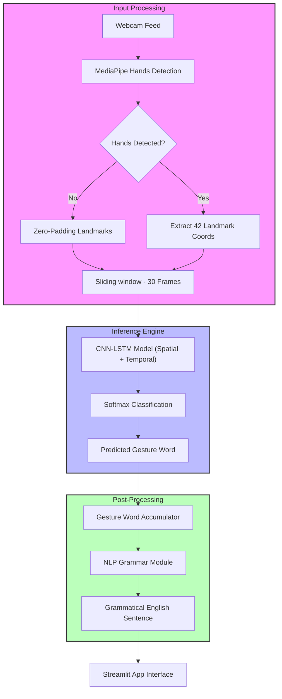

# 🤟 Gesture to Text Conversion Using Deep Neural Network

**GestureLink** is a real-time Sign Language to Text conversion system that bridges the communication gap using deep learning. It leverages **MediaPipe** for high-fidelity hand tracking, a custom **CNN-LSTM** architecture for temporal gesture recognition, and a specialized **NLP Grammar Engine** to generate coherent natural language sentences.


---

## 🚀 Key Features:

*   👐 **Dual-Hand Recognition** – Tracks both hands simultaneously (42 landmarks, 126 features)
*   🧠 **Hybrid CNN-LSTM Model** – Combines spatial (CNN) and temporal (LSTM) learning
*   📝 **NLP Grammar Engine** – Converts raw gesture sequences into meaningful grammatical sentences
*   ⚡ **Real-Time Inference** – Ultra-low latency predictions mirrored in a Streamlit UI
*   📊 **56 Gesture Classes** – Extensive vocabulary covering verbs, nouns, and everyday phrases
*   ☁️ **Colab Training Pipeline** – Fully automated GPU-ready training via Jupyter notebooks

---

## 🌍 Why This Project Matters

This system helps bridge the communication gap between deaf/mute individuals and the hearing community by enabling real-time gesture-to-text translation using state-of-the-art AI. It promotes inclusivity and independent communication.

---

## 🏗️ System Architecture



---

## 📁 Repository Structure

```text
GestureToTextConversion/
├── app.py                  # Main Streamlit application
├── nlp_module.py           # NLP grammar engine logic
├── model_architecture.py   # CNN-LSTM model definition
├── config.py               # Hyperparameters and settings
├── train.py                # Model training script
├── augment_data.py         # Advanced data augmentation
├── data_preprocessing.py   # Landmark extraction tool
├── colab_training.py       # Standalone training for Colab
├── create_notebook.py      # Script to generate Jupyter notebooks
├── requirements.txt        # Required dependencies
├── preprocessed_data/      # Label encoder and class names
├── models/                 # Model storage (ignored by git)
└── evaluation_results/     # Performance metrics and plots
```

---

## 📦 Dataset

The dataset is not included in this repository due to its large size. You can:
*   Collect your own gesture videos using the extraction scripts provided.
*   Link your own Google Drive dataset to the Colab notebook.

---

## 📥 Pretrained Model

Since model files are large, they are stored externally.
👉 **[Download Trained Model Here](YOUR_LINK_HERE)**

Place the downloaded files inside the `models/` directory:
```
models/gesture_model.h5
```

---

## 🛠️ Installation & Setup

1. **Clone the repo**:
   ```bash
   git clone https://github.com/shivammm1234/GestureToTextConversionUsingDeepNeuralNetwork.git
   cd GestureToTextConversionUsingDeepNeuralNetwork
   ```
2. **Setup virtual environment**:
   ```bash
   python -m venv venv
   venv\Scripts\activate   # Windows
   # source venv/bin/activate   # Linux/Mac
   ```
3. **Install dependencies**:
   ```bash
   pip install -r requirements.txt
   ```

---

## ☁️ Training (Google Colab)

1. Upload this project folder to Google Drive.
2. Open `Sign_Language_CNN_LSTM_NLP.ipynb` in Google Colab.
3. Enable GPU (Runtime → Change runtime type → T4 GPU).
4. Run all cells sequentially to train and evaluate.

---

## 🖥️ Run the Application

Launch the real-time Streamlit interface:
```bash
streamlit run app.py
```

### Usage Tips:
*   **Lighting**: Ensure the background is well-lit.
*   **Distance**: Keep your hands within the camera frame.
*   **Gestures**: Use both hands for dual-hand signs.
*   **Cooldown**: Adjust prediction timing in the sidebar settings.

---

## 📊 Model Performance

| Metric      | Value      |
| ----------- | ---------- |
| **Accuracy** | ~94%       |
| **Classes**  | 56 Gestures |
| **Input**    | 30 Frames × 126 Features |
| **Model**    | CNN (Spatial) + LSTM (Temporal) |

---

## 🛠️ Troubleshooting

| Issue | Solution |
| :--- | :--- |
| Webcam not working | Ensure browser has camera permissions. |
| Low accuracy | Improve lighting or retrain with more data. |
| Memory error | Reduce `BATCH_SIZE` in `config.py`. |
| Model not found | Verify `models/gesture_model.h5` exists. |

---

## 🙏 Acknowledgments

*   **Google MediaPipe** for robust hand tracking.
*   **TensorFlow/Keras** for deep learning frameworks.
*   **Streamlit** for the intuitive web interface.

---

<p align="center">Made with ❤️ for Accessible Technology</p>
